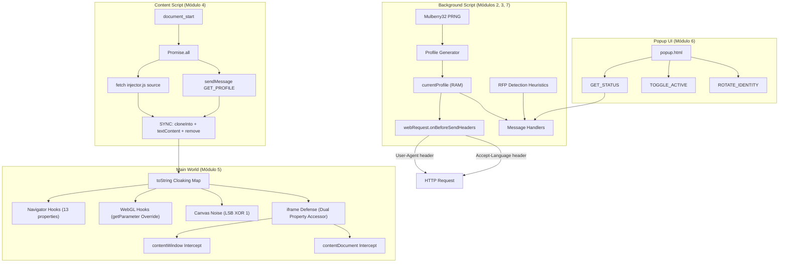

# 🎭 WebSpoffer v2

[](https://addons.mozilla.org/)
[](LICENSE)
[](https://abrahamjuliot.github.io/creepjs/)
[]()
[]()

**WebSpoffer v2** es una extensión de seguridad y privacidad de última generación para **Mozilla Firefox (Manifest V3)** diseñada para mitigar y neutralizar de forma indetectable las técnicas de *fingerprinting* (toma de huella digital) aplicadas por motores de detección comerciales y de código abierto (como CreepJS, FingerprintJS Pro y CoverYourTracks de la EFF).

A diferencia de los bloqueadores tradicionales que desactivan APIs o inyectan valores puramente aleatorios —lo cual genera huellas altamente anómalas que los detectores marcan como manipulación de inmediato—, WebSpoffer implementa la filosofía de **Spoofing Coherente**.

---

## 🌟 Filosofía: Spoofing Coherente

Para evitar penalizaciones en el *Trust Score* y flags de "Lies" (mentiras) en los detectores, WebSpoffer garantiza consistencia lógica en tres dimensiones principales:

1. **Coherencia de Plataforma:** Si la extensión simula macOS, presentará un User-Agent de macOS, un valor `navigator.platform` de `MacIntel`, un `oscpu` de Macintosh, resoluciones lógicas de pantallas Retina (DPR 2.0) y un renderizador WebGL nativo de Apple o Intel (evitando ANGLE Direct3D, exclusivo de Windows).
2. **Coherencia Temporal:** Sincroniza dinámicamente el desplazamiento de minutos (`getTimezoneOffset`), la representación en cadena del huso horario (`Date.prototype.toString`) y la resolución a nivel internacional (`Intl.DateTimeFormat`), adaptándose automáticamente al Horario de Verano (DST) del huso emulado.
3. **Coherencia Geográfica e Idiomática:** Vincula la zona horaria simulada con la lista de lenguajes del navegador (`navigator.language` / `languages`) y las cabeceras HTTP de negociación (`Accept-Language`).

---

## 📐 Arquitectura del Sistema

El siguiente diagrama detalla cómo interactúan los componentes de WebSpoffer (Background Engine, Content Script, Main World Injector y Popup UI) para aislar y proteger tu huella digital de forma transparente y sin latencia:



---

## 🛠️ Pilares Tecnológicos & Evasión Avanzada

### 1. Motor de Identidad & PRNG Mulberry32 (background.js)
El uso de `Math.random()` para generar ruido es autodestructivo. Detectores como CreepJS toman múltiples lecturas de Canvas o AudioContext en la misma página; si el valor muta en cada lectura, detectan *"Fingerprint tampering"*.
*   **Solución:** WebSpoffer utiliza un generador pseudo-aleatorio determinista (PRNG) de 32 bits llamado **Mulberry32**, alimentado por una semilla criptográfica única generada al inicio de la sesión mediante `crypto.getRandomValues()`.
*   Esto asegura que el ruido LSB aplicado sea idéntico en cada lectura dentro de la misma sesión (estabilidad del hash), pero completamente diferente del hardware físico subyacente.

### 2. Puente de Inyección Síncrono Atómico (content.js)
Las inyecciones tradicionales mediante `script.src` presentan condiciones de carrera (race conditions) y son bloqueadas por políticas CSP estrictas (`script-src 'self'`).
*   **Mecánica Atómica:** A `document_start`, `content.js` obtiene síncronamente el código de `injector.js` y el perfil de background en paralelo (~0.3ms).
*   **Xray Vision & cloneInto:** Usando la utilidad nativa de Firefox `cloneInto()`, se inyecta la configuración en el contexto global de la página (`wrappedJSObject`) como propiedad no-enumerable (`__SPOOF_CONFIG__`).
*   **Inyección síncrona:** Se asigna el código directamente a `.textContent` y se ejecuta síncronamente al hacer `appendChild()`. Ningún script de la página puede ejecutarse antes.
*   **Esterilización contra MutationObservers:** Para evitar que un MutationObserver examine el código del inyector en el nodo removido, se vacía `.textContent = ''` justo antes de hacer `script.remove()`.

### 3. toString Cloaking & Hooking (injector.js)
Para evitar que un detector descubra funciones modificadas inspeccionando su código fuente mediante `func.toString()` (lo que marcaría un flag de "Lies"), implementamos cloaking nativo de segundo orden:
*   Se crea un `Map` privado (`_cloakRegistry`) inaccesible fuera de la IIFE.
*   Se reemplaza `Function.prototype.toString` globalmente para interceptar las funciones hookeadas y retornar su código nativo original correspondiente.
*   El propio wrapper de `toString` se auto-registra a sí mismo para que `Function.prototype.toString.toString()` devuelva la representación exacta nativa: `"function toString() {\n    [native code]\n}"`.
*   `hookGetter` y `hookMethod` conservan y clonan exactamente la estructura del descriptor original (`enumerable`, `configurable`, `set` undefined, y propiedades de Firefox como `.name` y `.length`).

### 4. Defensa contra Iframes (injector.js)
Los detectores crean `iframe` invisibles en el mismo origen para instanciar contextos de `window` y `navigator` limpios y compararlos con la ventana superior, desenmascarando el spoofing.
*   **Bypass de Loophole:** Interceptamos los getters `contentWindow` y `contentDocument` (via `defaultView`) de `HTMLIFrameElement.prototype`.
*   **Parcheo On-Access:** Al acceder a un iframe, WebSpoffer inyecta de inmediato todos los hooks locales y un `toString` cloaker local dentro del iframe. Se utiliza un `WeakSet` (`_patchedContexts`) para evitar re-parcheos redundantes y bucles recursivos.

### 5. Timezone, Plugins & AudioContext Sync (injector.js)
*   **Timezone Sync:** Intercepta `getTimezoneOffset()`, `Date.prototype.toString` y `Intl.DateTimeFormat.prototype.resolvedOptions`. Un `WeakSet` (`_explicitTZInstances`) previene alterar el huso si el constructor de la página especifica uno explícitamente.
*   **Plugins Emulation:** Emula fielmente la estructura de clases del navegador Firefox instanciando prototipos de `PluginArray.prototype` y `Plugin.prototype`, simulando los 5 plugins PDF estándar de Firefox y evitando el "Plugin prototype leak".
*   **AudioContext Spoofing:** Inyecta ruido determinista de nivel $10^{-7}$ en `AudioBuffer.prototype.getChannelData` y `copyFromChannel` y `AnalyserNode` frequency/byte data. Un `WeakMap` evita inyecciones de ruido acumulativas.

### 6. Heurística contra RFP (background.js)
La función nativa `privacy.resistFingerprinting` (RFP) de Firefox entra en colisión directa con WebSpoffer, forzando la zona horaria a UTC y la resolución a 900x600, lo que genera anomalías lógicas.
*   **Heurística de Detección:** WebSpoffer evalúa dos señales en el background script sin requerir permisos especiales:
    1.  *Precisión temporal:* Toma 30 muestras en busy loops de `performance.now()`. Si los deltas carecen de componente fraccional y son múltiplos de 2, indica redondeo agresivo por RFP.
    2.  *Huso UTC:* Verifica si la zona horaria por defecto resuelta es `UTC`.
*   Si se detecta RFP, la interfaz de usuario de la extensión muestra una alerta amarilla recomendando desactivar RFP en `about:config` para no comprometer el spoofing coherente.

### 7. webRequest Blocking (background.js)
*   **Consistencia Red-JS:** Firefox MV3 mantiene soporte completo para la API síncrona bloqueante `webRequest.onBeforeSendHeaders`. Esto permite interceptar y sincronizar las cabeceras HTTP de salida con los valores de JavaScript en tiempo real.
*   **Zero I/O Bottleneck:** Para evitar latencias de red, el listener consulta directamente la memoria RAM (`currentProfile`), evitando lecturas de almacenamiento local.
*   **Evasión de Client Hints:** Remueve preventivamente cualquier cabecera `Sec-CH-UA*` (Client Hints de Chromium) que pueda alertar a un WAF de inconsistencias si simulamos Firefox.

---

## 📁 Estructura del Proyecto

```
webSpoffer/
├── manifest.json          ← Especificaciones del complemento, permisos MV3 de Firefox y Gecko ID
├── background.js          ← Motor de identidad, Mulberry32 PRNG, base perfiles, mensajería, RFP y webRequest
├── content.js             ← Puente de inyección síncrono atómico (textContent)
├── injector.js            ← Monkey patcher del Main World (toString cloaking, hooks, iframes y parches)
├── popup/
│   ├── popup.html         ← Estructura de UI (Dark tactical theme)
│   ├── popup.css          ← Estilo visual y panel de telemetría
│   └── popup.js           ← Controlador de interacción (Toggle y Rotación de Identidad)
├── icons/                 ← Recursos gráficos de la extensión
│   ├── icon-48.svg
│   └── icon-96.svg
└── README.md              ← Esta documentación de repositorio
```

---

## 📊 Matriz de APIs Spoofeadas

| API JavaScript / Propiedad | Valor Real de Retorno | Valor Simulado (Spoofed) | Detector / Test Evadido | Propósito Técnico |
| :--- | :--- | :--- | :--- | :--- |
| `Navigator.prototype.userAgent` | Datos físicos del sistema del usuario | `profile.navigator.userAgent` | CreepJS, FingerprintJS, CYT | Coherencia en la identidad básica del navegador. |
| `Navigator.prototype.platform` | Plataforma nativa (ej. `Win32`) | `profile.navigator.platform` | CreepJS, CoverYourTracks | Elimina la firma de compilación nativa del kernel. |
| `Navigator.prototype.oscpu` | Información de arquitectura de Gecko | `profile.navigator.oscpu` | CreepJS (Chequeo de Lies) | Evita discrepancias con el OS del User-Agent. |
| `Navigator.prototype.buildID` | ID de compilación interno real | `"20181001000000"` (Fijo) | CreepJS | Replica el comportamiento de privacidad de Firefox. |
| `Navigator.prototype.plugins` | Lista física de plugins del usuario | Emulación de 5 plugins de Firefox PDF | CreepJS, CoverYourTracks | Neutraliza la prueba de prototipo y formato de PDF. |
| `Navigator.prototype.languages` | Idiomas del sistema del usuario | Array de idiomas coherente con zona | CreepJS, BrowserLeaks | Asegura coherencia geográfica y de idioma. |
| `Screen.prototype.width / height` | Resolución nativa del monitor físico | Dimensiones lógicas del perfil | CreepJS (Screen resolution) | Elimina la huella única de dimensiones físicas. |
| `Window.prototype.devicePixelRatio` | DPR real del monitor físico | DPR coherente con la plataforma | CreepJS, BrowserLeaks | Mantiene coherencia de pantalla HiDPI/Retina. |
| `Date.prototype.getTimezoneOffset` | Desplazamiento local de la máquina | Offset calculado para zona emulada | CreepJS, CoverYourTracks | Sincronización temporal numérica en cálculos. |
| `Date.prototype.toString` | Fecha local con huso de máquina | Reemplazo GMT + Nombre emulado | CreepJS (Timezone checks) | Pasa los chequeos reflexivos de fecha en texto. |
| `WebGLRenderingContext.getParameter` | GPU real de la tarjeta del usuario | GPU emulada (Vendor/Renderer) | CreepJS, FingerprintJS Pro | Oculta el hardware gráfico físico subyacente. |
| `CanvasRenderingContext2D.getImageData` | Hash de dibujo de píxeles nativo | Imagen con ruido LSB determinista | CreepJS, CoverYourTracks | Altera el hash del lienzo de dibujo de forma de onda. |
| `AudioBuffer.prototype.getChannelData` | Firma de frecuencia del DAC físico | Muestra con ruido determinista $10^{-7}$ | CoverYourTracks | Evita la identificación de hardware de sonido. |
| `HTMLIFrameElement.prototype.contentWindow`| Ventana del iframe con datos limpios | Ventana del iframe parcheada on-access | CreepJS (Lies: iframe leaks) | Bloquea la fuga de propiedades mediante sub-marcos. |

---

## 🔍 Protocolo de Validación Técnica (Evasión Checklist)

Sigue estos pasos detallados para validar la integridad del spoofing y confirmar la ausencia de fugas:

### Paso 1: Instalación Temporal
1. Abre Firefox y navega a `about:debugging`.
2. Haz clic en **"Este Firefox"** y luego en **"Cargar complemento temporal..."**.
3. Selecciona el archivo `manifest.json` en el directorio de WebSpoffer.
4. Verifica en la consola del background la inicialización:
   - `[WebSpoffer] ✓ Perfil inicializado (nuevo)`
   - `[WebSpoffer] ✓ Módulo 3 activo: Interceptor de cabeceras HTTP`

### Paso 2: Análisis en BrowserLeaks
Visita [browserleaks.com](https://browserleaks.com) y comprueba las siguientes secciones críticas:
*   **User Agent (JS & HTTP Headers):** Ambos valores deben coincidir exactamente, sin discrepancias de compilación o versión.
*   **WebGL:** El Vendor y Renderer deben reflejar el hardware simulado (ej. ANGLE o Mesa Intel/NVIDIA) de forma coherente con el sistema operativo emulado.
*   **Canvas:** El Fingerprint Hash debe diferir del de tu hardware real, manteniéndose **estable y el mismo** en cada recarga de página.
*   **Screen & Resolution:** Las dimensiones y profundidad de color deben encajar exactamente con el perfil de pantalla del OS elegido.

### Paso 3: Auditoría Estricta en CreepJS
Visita [abrahamjuliot.github.io/creepjs](https://abrahamjuliot.github.io/creepjs/) y audita la coherencia interna:
*   **Trust Score:** Debe reportar un valor verde saludable (idealmente $\geq 70\%$).
*   **Lies & Trash:** Deben reportar **0** anomalías detectadas. Esto garantiza que el toString cloaking, el cleanup de variables y la inyección síncrona son exitosos.
*   **iframe Lies:** Comprueba la sección de iframes; no deben listarse discrepancias de User-Agent o de variables de Navigator entre iframes y la ventana padre.
*   **navigator.platform & oscpu:** Deben tener marcas de verificación verde ($\checkmark$), confirmando que coinciden lógicamente con el OS simulado.

### Paso 4: Pruebas de Rotación y Toggle
1. Abre el panel de WebSpoffer haciendo clic en el icono de la extensión.
2. Desactiva el conmutador de la extensión y recarga BrowserLeaks: el sitio web debe reportar tu hardware físico real.
3. Vuelve a activar el conmutador, haz clic en **"🔄 Rotar Identidad"**: el panel de control debe reportar una nueva plataforma y la página activa debe recargarse de manera automática, aplicando de inmediato la nueva identidad coherente.

### Paso 5: Colisión de RFP
1. Activa en `about:config` la opción `privacy.resistFingerprinting` (RFP = `true`).
2. Abre el Popup de WebSpoffer y verifica la aparición de la alerta de colisión nativa.
3. Desactiva RFP para asegurar el funcionamiento óptimo de las identidades personalizadas de la extensión.

---

## ⚙️ Resumen de Desarrollo por Módulo

El código fuente total de la extensión está compuesto por aproximadamente **2,950 líneas** distribuidas en los siguientes componentes clave:

| Módulo | Componente Técnico | Archivo(s) | Líneas | Resumen de Funcionalidad |
| :---: | :--- | :--- | :---: | :--- |
| **1** | Manifest de Complemento | `manifest.json` | ~58 | Configuración de permisos, Gecko ID, inyección y permisos de red MV3. |
| **2** | Motor de Identidad | `background.js` §1-6 | ~920 | Generación de perfiles coherentes, PRNG Mulberry32 y persistencia en storage. |
| **3** | Interceptor HTTP | `background.js` §8 | ~130 | Modificación síncrona bloqueante de cabeceras HTTP y eliminación de Client Hints. |
| **4** | Puente de Inyección | `content.js` | ~355 | Resolución paralela asíncrona, cloneInto en Xray Vision y textContent. |
| **5** | Monkey Patcher | `injector.js` | ~884 | toString cloaking, hooks de APIs del Main World, sincronización y parches de ruido. |
| **6** | Popup de Control | `popup/` (3 files) | ~500 | Interfaz de usuario táctica, panel de telemetría y llamadas de rotación. |
| **7** | Detección de Colisiones | `background.js` §7.5 | ~100 | Heurística para identificar la presencia activa de `resistFingerprinting` nativo. |

---

## ⚖️ Licencia y Descargo de Responsabilidad

Este proyecto se distribuye bajo la licencia **GNU Affero General Public License v3 (AGPLv3)**. Para más detalles, consulta el archivo [LICENSE](file:///c:/Users/renat/OneDrive/Documentos/ProgramacionVs/webSpoffer/LICENSE).

> [!IMPORTANT]
> **Requisito de Código Abierto (Copyleft):** Bajo los términos de la licencia AGPLv3, si modificas este software y lo distribuyes o lo ejecutas de manera que sea accesible por terceros a través de una red, estás legalmente obligado a poner a disposición del público el código fuente completo de tu versión modificada bajo esta misma licencia.

> [!CAUTION]
> **Exclusión de Garantía y Propósito Educativo:** Este software se proporciona "tal cual", sin garantía de ningún tipo, expresa o implícita. Se distribuye únicamente con fines de investigación, educación y auditoría de ciberseguridad sobre técnicas de fingerprinting en la web. El uso indebido del software o de técnicas de suplantación de identidad en sitios web de terceros es responsabilidad exclusiva del usuario.
